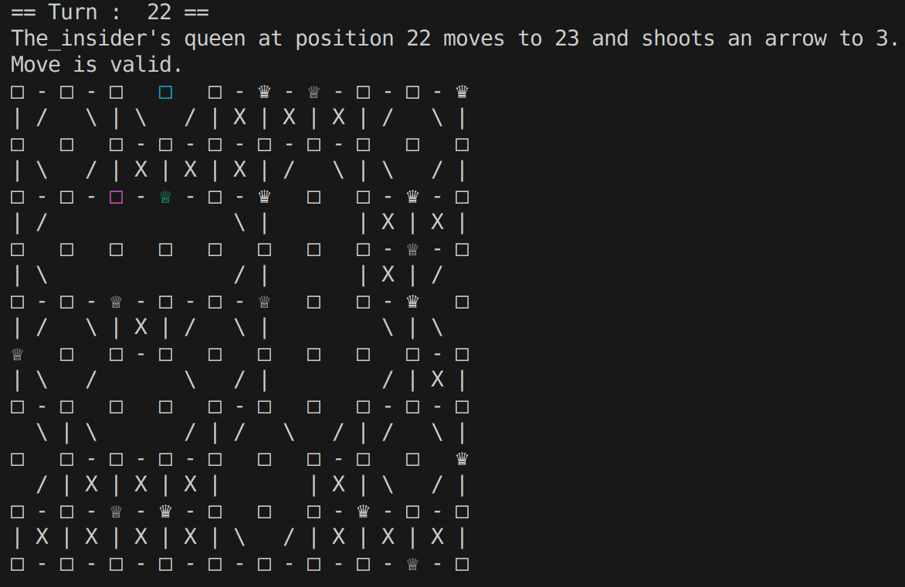

# Game of the Amazons

Game of the Amazons is a board games similar to chess. Check [Wikipedia](https://en.wikipedia.org/wiki/Game_of_the_Amazons) for rules (and more).

This is a school project done in early-mid 2023. The objective was to implement the Games of the Amazons with a player/server systems using dynamic libraries. All students groups (~25 groups) were ranked on a ladder depending on victories and defeats against other groups' players.
We ranked 4th with a [minimax algorithm](https://en.wikipedia.org/wiki/Minimax) and a well cooked heuristic evaluation function.

## Files

- `install_dir` : Contains several files post comilation such as exe file, players libraries...
- `src`
  - `client`
    - `common_player.c` : common file for all player &rarr; basic functions (movement, position checks, ...) and personal variables (copy of board, positions of pieces...)
    - `player.c` : player's file &rarr; implements a specific strategy
  - `server`
    - `server.c`: server file &rarr; implements connexion between players and `main` function
    - `rule.c` : implements serveral utilitary functions and a security check (checks if a move from a player is valid)
  - `.h` files : declare differents utilitary functions, enums...
  - `graph.c` : contains differents board (classic board, window board, etc)
  - `disp.c` : display function
- `tst` : all test files (mostly visual because easier :dumb:, but still some assert)
- `Makefile` : See below

## How to Makefile

This project use a Makefile to compile and run executables.
- `make` : compile the whole project
- `make build` : compile only the main files (no tests)
- `make run` : compile only the main files and run the project (edit the makefile to run different players with differents parameter or in command line execute ./install_dir/server -flag...)
- `make test` : compile the project and tests files
- `make runtests` : compile the project, tests files and run tests
- `make clean` : delete all compiled files

When running, there are multiple parameters that can be modified through flags :
- `-m` : specifies the dimensions of the board (example : `-m 10` for a 10 by 10 board)
- `-t` : specifies the shape of the board
  - `-t c` : square shape
  - `-t d` : donut shape
  - `-t t` : clover shape
  - `-t 8` : eight shape

Players are directly specified as parameter (example : `./server -m 10 -t c ./player1.so ./player2.so`).

## Screenshot

Moving queen is in green, her former position in pink and the position where her arrow landed is in blue.
Positions are numbered left to right, up to down.

## Authors

[PotatOwO](https://github.com/UnePatate5010)

[Larwive](https://github.com/Larwive)

[GeekBoyBoss](https://github.com/GeeKboy2)

[Pyrhanox](https://github.com/Pyrhanox)
